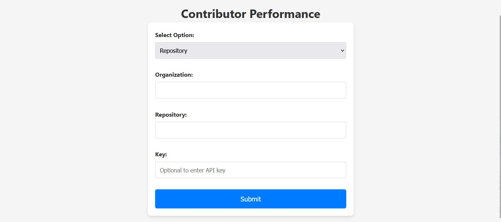
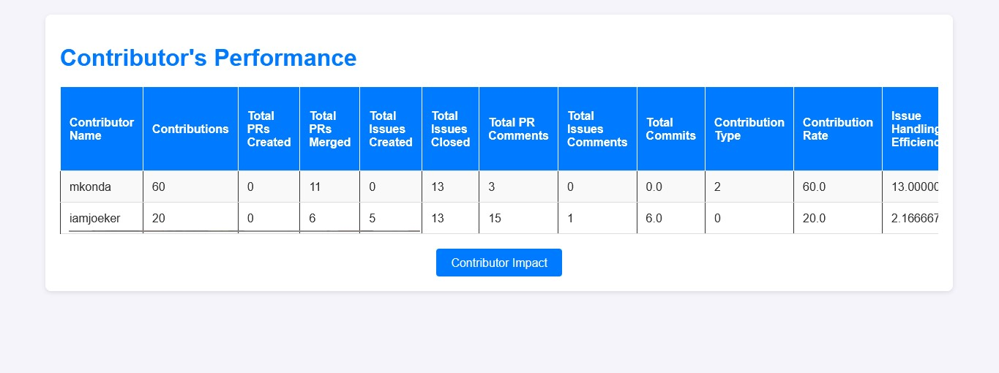
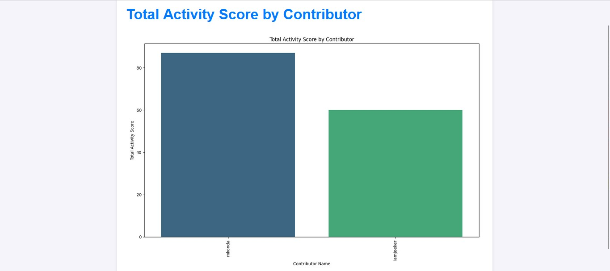

# Open-Source Contributor Performance Analysis System

## Description
The **Open-Source Contributor Performance Analysis System** is a machine learning-powered application that analyzes contributor performance in open-source GitHub repositories. By collecting extensive data and applying advanced analytical techniques, this system provides valuable insights into contributor activities, helping project maintainers and contributors alike to understand performance metrics comprehensively.

## Table of Contents
- [Features](#features)
- [Installation](#installation)
- [Usage](#usage)
- [User Journey](#user-journey)
- [Contributing](#contributing)
- [License](#license)
- [Contact](#contact)

## Screenshots

Front Page:


Report Page:


Graph Page:


## Features
- **Data Collection**: Integrates with GitHub API to gather repository data such as commits, pull requests, issues, and comments.
- **Feature Engineering**: Employs advanced techniques to extract meaningful features that reflect contributor performance.
- **Machine Learning Models**: Utilizes machine learning to analyze contribution types, predict pull request acceptance, and more.
- **Performance Scoring**: Offers a transparent scoring system to evaluate contributor performance fairly.
- **Visualization**: Provides an intuitive dashboard for visualizing individual and team performance metrics.
- **Customization**: Allows users to adjust scoring weightings and integrate with other development tools.
- **Continuous Monitoring**: Supports ongoing data collection and real-time performance tracking.

## Installation
To set up the project, follow these steps:

1. Clone the repository:
   ```bash
   git clone https://github.com/MadGanGithub/Github_Contribution.git
   cd Github_Contribution
   python manage.py runserver